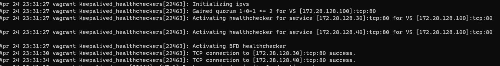

# Домашнее задание к занятию <<000 это тест>>

Надо протестировать
## Задание 1 - Тест1

1. Первый ответ
2. 2й Ответ
3. Вот такой вывод

4. Это команда `git push`
5. Это код
```bash
#!/bin/bash
# display command line options

count=1
for param in "$*"; do
    echo "\$* Parameter #$count = $param"
    count=$(( $count + 1 ))
done
```
6. Это ссылка на мой [репозиторий](https://github.com/jevgenizabelin/netology-homeworks.git)

