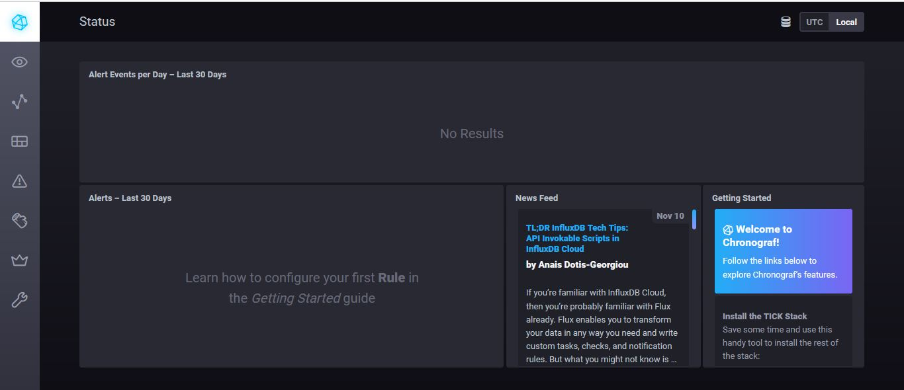
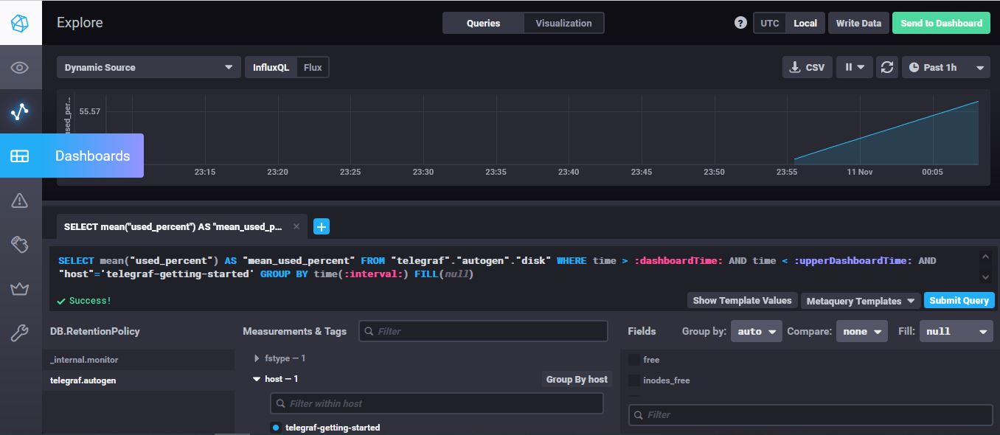
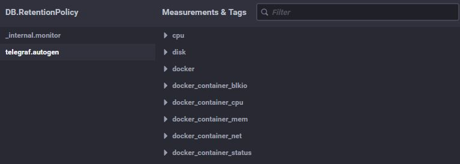

# Домашнее задание к занятию "10.02. Системы мониторинга"

##  Обязательные задания


1. 
Плюсы Pull - настройка защищенного соединения по TLS, легче контроллировать данные с агентов, можно собирать метрики по HTTP используя различные инструменты для этого.

Минусы Pull - не имеет настроек репликации, больше нагрузка из-за использования TCP

Плюсы Push - всё централизовано, можно сделать изменения на сервере и они распростронятся на все нужные агенты. Гибкая и динамичная настройка, шаблоны, которые можно применять на многие хосты. Можно собирать бинарные данные. Гибкая настройка отправки пакетов данных с  метриками, упрощение репликации данных в разные системы мониторинга, использование UDP протокола, как менее затратного.

Минусы Push - Из-за протокола UDP, некоторые метрики могут не дойти до сервера. Не изпользует HTTP, обычно не имеет защищенного соединения TLS,

2. 
- Prometheus - по умолчанию использует Pull, но может и работать в режиме Push( pushgateway)
- TICK - Push
- Zabbix - по умолчанию использует Push, но может и работать в режиме Pull(например проверки через web, ssh, snmp)
- Nagios - Push
- VictoriaMetrics - Pull и Push. Это больше система для хранения метрик.
  


3. 

- `curl http://localhost:8086/ping -v`
  
```*   Trying 127.0.0.1:8086...
* TCP_NODELAY set
* Connected to localhost (127.0.0.1) port 8086 (#0)
> GET /ping HTTP/1.1
> Host: localhost:8086
> User-Agent: curl/7.68.0
> Accept: */*
>
* Mark bundle as not supporting multiuse
< HTTP/1.1 204 No Content
< Content-Type: application/json
< Request-Id: 72978efb-4266-11ec-8058-0242ac140002
< X-Influxdb-Build: OSS
< X-Influxdb-Version: 1.8.10
< X-Request-Id: 72978efb-4266-11ec-8058-0242ac140002
< Date: Wed, 10 Nov 2021 20:40:31 GMT
<
* Connection #0 to host localhost left intact
```


- `curl http://localhost:8888`

```<!DOCTYPE html><html><head><meta http-equiv="Content-type" content="text/html; charset=utf-8"><title>Chronograf</title><link rel="icon shortcut" href="/favicon.fa749080.ico"><link rel="stylesheet" href="/src.3dbae016.css"></head><body> <div id="react-root" data-basepath=""></div> <script src="/src.fab22342.js"></script> </body></html>```

- `curl http://localhost:9092/kapacitor/v1/ping -v`

```*   Trying 127.0.0.1:9092...
* TCP_NODELAY set
* Connected to localhost (127.0.0.1) port 9092 (#0)
> GET /kapacitor/v1/ping HTTP/1.1
> Host: localhost:9092
> User-Agent: curl/7.68.0
> Accept: */*
>
* Mark bundle as not supporting multiuse
< HTTP/1.1 204 No Content
< Content-Type: application/json; charset=utf-8
< Request-Id: da1b644a-4266-11ec-8086-000000000000
< X-Kapacitor-Version: 1.6.2
< Date: Wed, 10 Nov 2021 20:43:25 GMT
<
* Connection #0 to host localhost left intact
```



4. 


5. 


