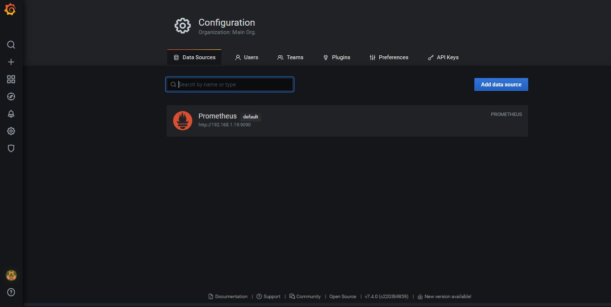
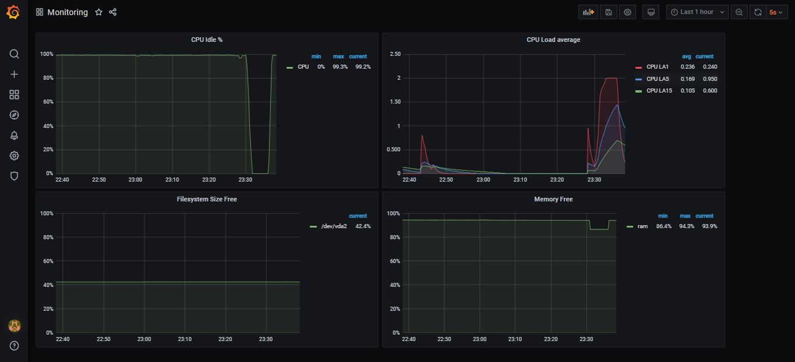

# Домашнее задание к занятию "10.03. Grafana"

## Обязательные задания

### Задание 1

### Задание 2

- (avg by (instance) (rate(node_cpu_seconds_total{instance="nodeexporter:9100", job="nodeexporter", mode="idle"}[1m])) * 100)

- node_load1
- node_load5
- node_load15

- 100 - node_memory_Inactive_bytes/node_memory_MemAvailable_bytes*100

- node_filesystem_avail_bytes{fstype!~"tmpfs|fuse.lxcfs|squashfs"} / node_filesystem_size_bytes{fstype!~"tmpfs|fuse.lxcfs|squashfs"}*100
  

### Задание 3

