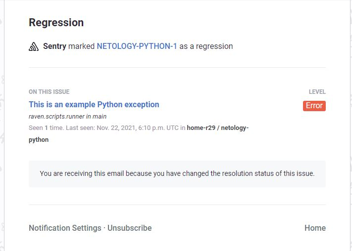
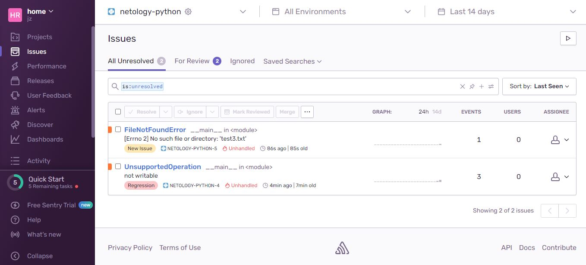
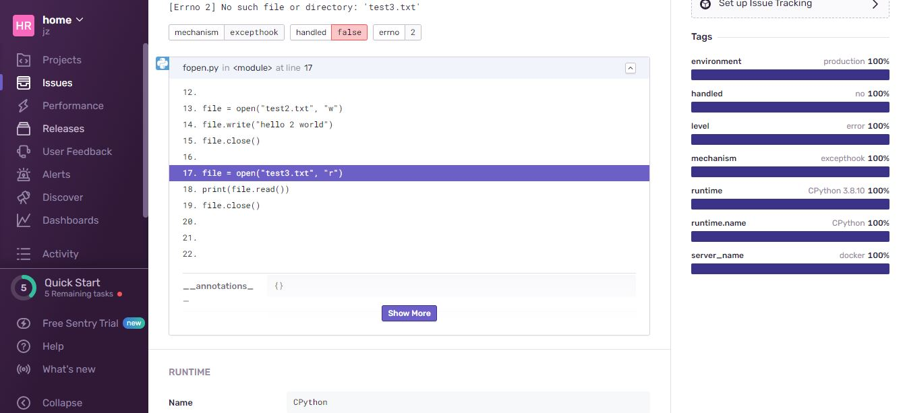

# Домашнее задание к занятию "10.05. Sentry"

## Задание 1


## Задание 2

- unresolved issue


- resolved issue
  


- stack trace


## Задание 3

- mail alert
  


## Задание повышенной сложности

Создал 2 тестовых события





```python
import sentry_sdk


sentry_sdk.init(
    "https://74991ac7df084fbcaa9e38bdcf07d4ea@o1075405.ingest.sentry.io/6076030",
    traces_sample_rate=1.0
)

open('test2.txt','a').close()

file = open("test2.txt", "w")
file.write("hello 2 world")
file.close()

file = open("test3.txt", "r")
print(file.read())
file.close()
```
