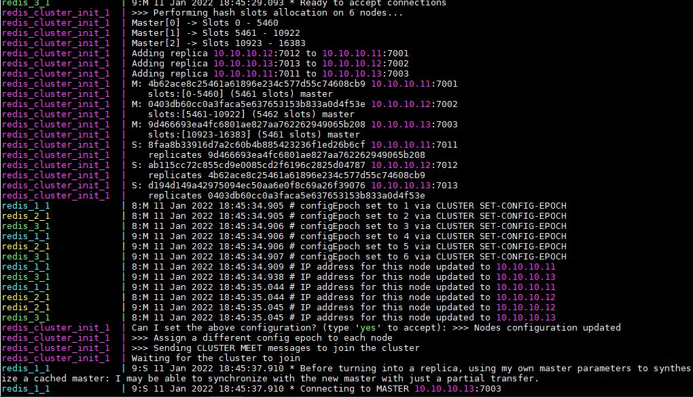
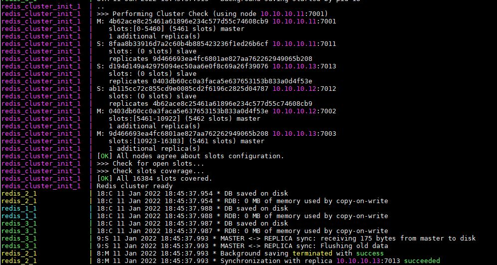
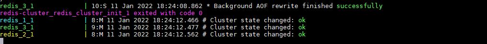
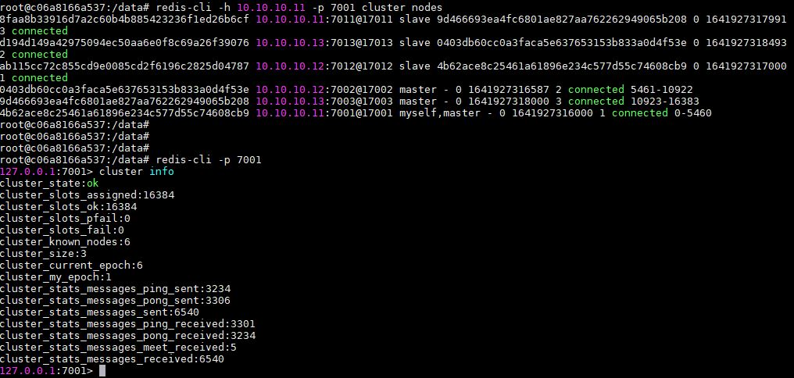

#  Домашнее задание к занятию "11.04 Микросервисы: масштабирование"

##  Задача 1: Кластеризация

- Думаю что самым лучшим выбором будет Kubernetes, как система кластеризации. На данный момент Kubernetes является самым популярным и распространенным, бесплатный, с обширной документацией, соответствует всем требованиям в задании. Можно установить на все платформы.

##  Задача 2: Распределенный кэш * (необязательная)

- Redis cluster docker-compose.yml
  
  

- cluster init

- cluster info

