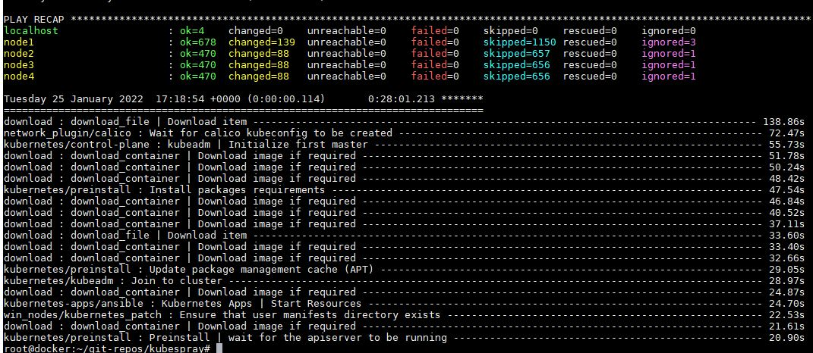
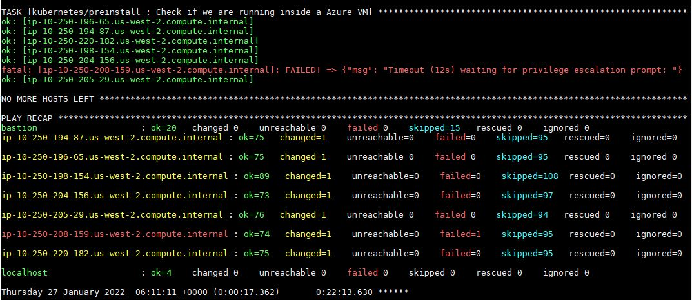
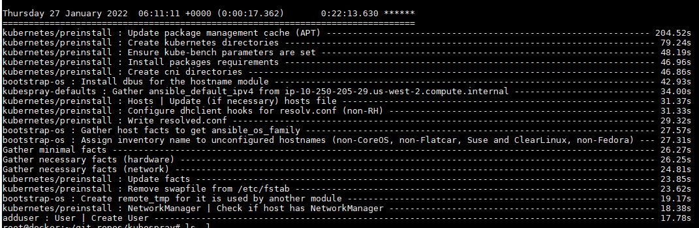

#  Домашнее задание к занятию "12.4 Развертывание кластера на собственных серверах, лекция 2"

##  Задание 1: Подготовить инвентарь kubespray

Буду создавать кластер в локальной сети. 1 Control Plane и 3 work nodes.

```
root@docker:~/git-repos/kubespray/inventory/mycluster# cat inventory.ini
# ## Configure 'ip' variable to bind kubernetes services on a
# ## different ip than the default iface
# ## We should set etcd_member_name for etcd cluster. The node that is not a etcd member do not need to set the value, or can set the empty string value.
[all]
node1 ansible_host=192.168.1.24  # ip=10.3.0.1 etcd_member_name=etcd1
node2 ansible_host=192.168.1.22  # ip=10.3.0.2 etcd_member_name=etcd2
node3 ansible_host=192.168.1.23  # ip=10.3.0.3 etcd_member_name=etcd3
node4 ansible_host=192.168.1.25  # ip=10.3.0.4 etcd_member_name=etcd4
# node5 ansible_host=95.54.0.16  # ip=10.3.0.5 etcd_member_name=etcd5
# node6 ansible_host=95.54.0.17  # ip=10.3.0.6 etcd_member_name=etcd6

# ## configure a bastion host if your nodes are not directly reachable
# [bastion]
# bastion ansible_host=x.x.x.x ansible_user=some_user

[kube_control_plane]
node1
# node2
# node3

[etcd]
node1
# node2
# node3

[kube_node]
node2
node3
node4
# node5
# node6

[calico_rr]

[k8s_cluster:children]
kube_control_plane
kube_node
calico_rr
```

```
ansible-playbook -i inventory/mycluster/inventory.ini --become --become-user=root cluster.yml
```
Получаем результат


Проверяем кластер
```
root@node1:~# kubectl cluster-info
Kubernetes control plane is running at https://127.0.0.1:6443

To further debug and diagnose cluster problems, use 'kubectl cluster-info dump'.

root@node1:~# kubectl get nodes
NAME    STATUS   ROLES                  AGE    VERSION
node1   Ready    control-plane,master   131m   v1.23.1
node2   Ready    <none>                 130m   v1.23.1
node3   Ready    <none>                 130m   v1.23.1
node4   Ready    <none>                 130m   v1.23.1
```

##  Задание 2 (*): подготовить и проверить инвентарь для кластера в AWS

- Подготовка инфраструктуры

Добавил данные в `credentials.tfvars`, 
, 


```
root@docker:~/git-repos/kubespray/contrib/terraform/aws# terraform apply -var-file=credentials.tfvars
╷
│ Error: Module not installed
│
│   on create-infrastructure.tf line 18:
│   18: module "aws-vpc" {
│
│ This module is not yet installed. Run "terraform init" to install all modules required by this configuration.
╵
╷
│ Error: Module not installed
│
│   on create-infrastructure.tf line 29:
│   29: module "aws-elb" {
│
│ This module is not yet installed. Run "terraform init" to install all modules required by this configuration.
╵
╷
│ Error: Module not installed
│
│   on create-infrastructure.tf line 41:
│   41: module "aws-iam" {
│
│ This module is not yet installed. Run "terraform init" to install all modules required by this configuration.
```
```
root@docker:~/git-repos/kubespray/contrib/terraform/aws# terraform init
Initializing modules...
- aws-elb in modules/elb
- aws-iam in modules/iam
- aws-vpc in modules/vpc

Initializing the backend...

Initializing provider plugins...
- Finding latest version of hashicorp/aws...
- Finding latest version of hashicorp/null...
- Finding latest version of hashicorp/template...
- Installing hashicorp/aws v3.73.0...
- Installed hashicorp/aws v3.73.0 (signed by HashiCorp)
- Installing hashicorp/null v3.1.0...
- Installed hashicorp/null v3.1.0 (signed by HashiCorp)
- Installing hashicorp/template v2.2.0...
- Installed hashicorp/template v2.2.0 (signed by HashiCorp)

Terraform has created a lock file .terraform.lock.hcl to record the provider
selections it made above. Include this file in your version control repository
so that Terraform can guarantee to make the same selections by default when
you run "terraform init" in the future.

Terraform has been successfully initialized!

You may now begin working with Terraform. Try running "terraform plan" to see
any changes that are required for your infrastructure. All Terraform commands
should now work.

If you ever set or change modules or backend configuration for Terraform,
rerun this command to reinitialize your working directory. If you forget, other
commands will detect it and remind you to do so if necessary.
```
Вот удачный вывод в конце выполнения команды `terraform apply -var-file=credentials.tfvars`

```
root@docker:~/git-repos/kubespray/contrib/terraform/aws# terraform apply -var-file=credentials.tfvars
Apply complete! Resources: 16 added, 0 changed, 0 destroyed.

Outputs:

aws_elb_api_fqdn = "kubernetes-elb-devtest-1935903055.us-west-2.elb.amazonaws.com:6443"
bastion_ip = "54.201.65.178"
default_tags = tomap({})
etcd = "10.250.204.156"
inventory = <<EOT
[all]
ip-10-250-205-29.us-west-2.compute.internal ansible_host=10.250.205.29
ip-10-250-198-154.us-west-2.compute.internal ansible_host=10.250.198.154
ip-10-250-208-159.us-west-2.compute.internal ansible_host=10.250.208.159
ip-10-250-194-87.us-west-2.compute.internal ansible_host=10.250.194.87
ip-10-250-220-182.us-west-2.compute.internal ansible_host=10.250.220.182
ip-10-250-196-65.us-west-2.compute.internal ansible_host=10.250.196.65
ip-10-250-204-156.us-west-2.compute.internal ansible_host=10.250.204.156
bastion ansible_host=54.201.65.178

[bastion]
bastion ansible_host=54.201.65.178

[kube_control_plane]
ip-10-250-205-29.us-west-2.compute.internal

[kube_node]
ip-10-250-198-154.us-west-2.compute.internal
ip-10-250-208-159.us-west-2.compute.internal
ip-10-250-194-87.us-west-2.compute.internal
ip-10-250-220-182.us-west-2.compute.internal
ip-10-250-196-65.us-west-2.compute.internal

[etcd]
ip-10-250-204-156.us-west-2.compute.internal

[calico_rr]

[k8s_cluster:children]
kube_node
kube_control_plane
calico_rr

[k8s_cluster:vars]
apiserver_loadbalancer_domain_name="kubernetes-elb-devtest-1935903055.us-west-2.elb.amazonaws.com"

EOT
masters = "10.250.205.29"
workers = <<EOT
10.250.198.154
10.250.208.159
10.250.194.87
10.250.220.182
10.250.196.65
EOT
```
Получившийся на выходе фаил 

- Разворачиваем кластер
  
`ansible-playbook -i ./inventory/hosts ./cluster.yml -e ansible_user=ubuntu -b --become-user=root --flush-cache
`
- Вот результат




Копировал конфиг себе на комп по этой инструкции

```
# Get the controller's IP address.
CONTROLLER_HOST_NAME=$(cat ./inventory/hosts | grep "\[kube_control_plane\]" -A 1 | tail -n 1)
CONTROLLER_IP=$(cat ./inventory/hosts | grep $CONTROLLER_HOST_NAME | grep ansible_host | cut -d'=' -f2)

# Get the hostname of the load balancer.
LB_HOST=$(cat inventory/hosts | grep apiserver_loadbalancer_domain_name | cut -d'"' -f2)

# Get the controller's SSH fingerprint.
ssh-keygen -R $CONTROLLER_IP > /dev/null 2>&1
ssh-keyscan -H $CONTROLLER_IP >> ~/.ssh/known_hosts 2>/dev/null

# Get the kubeconfig from the controller.
mkdir -p ~/.kube
ssh -F ssh-bastion.conf ubuntu@$CONTROLLER_IP "sudo chmod 644 /etc/kubernetes/admin.conf"
scp -F ssh-bastion.conf ubuntu@$CONTROLLER_IP:/etc/kubernetes/admin.conf ~/.kube/config
sed -i "s^server:.*^server: https://$LB_HOST:6443^" ~/.kube/config
```

- Проверяем кластер

```
root@docker:~/git-repos/kubespray# kubectl get nodes
NAME                                           STATUS   ROLES                  AGE   VERSION
ip-10-250-194-87.us-west-2.compute.internal    Ready    <none>                 11h   v1.23.1
ip-10-250-196-65.us-west-2.compute.internal    Ready    <none>                 11h   v1.23.1
ip-10-250-198-154.us-west-2.compute.internal   Ready    <none>                 11h   v1.23.1
ip-10-250-205-29.us-west-2.compute.internal    Ready    control-plane,master   11h   v1.23.1
ip-10-250-208-159.us-west-2.compute.internal   Ready    <none>                 11h   v1.23.1
ip-10-250-220-182.us-west-2.compute.internal   Ready    <none>                 11h   v1.23.1
```

```
root@docker:~/git-repos/kubespray# kubectl cluster-info
Kubernetes control plane is running at https://kubernetes-elb-devtest-1935903055.us-west-2.elb.amazonaws.com:6443

To further debug and diagnose cluster problems, use 'kubectl cluster-info dump'.
```

