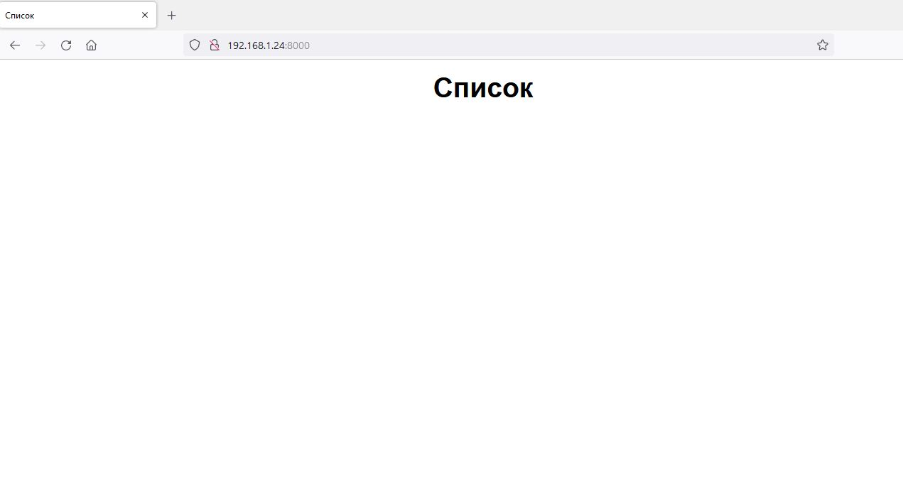
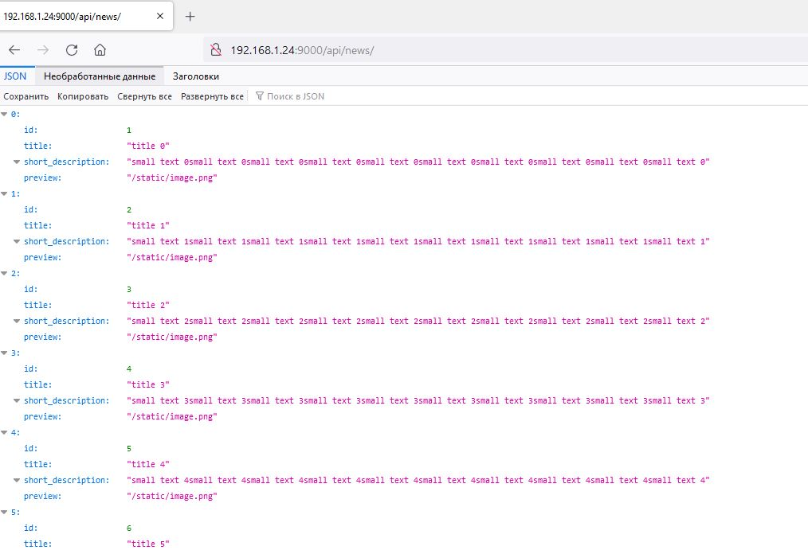
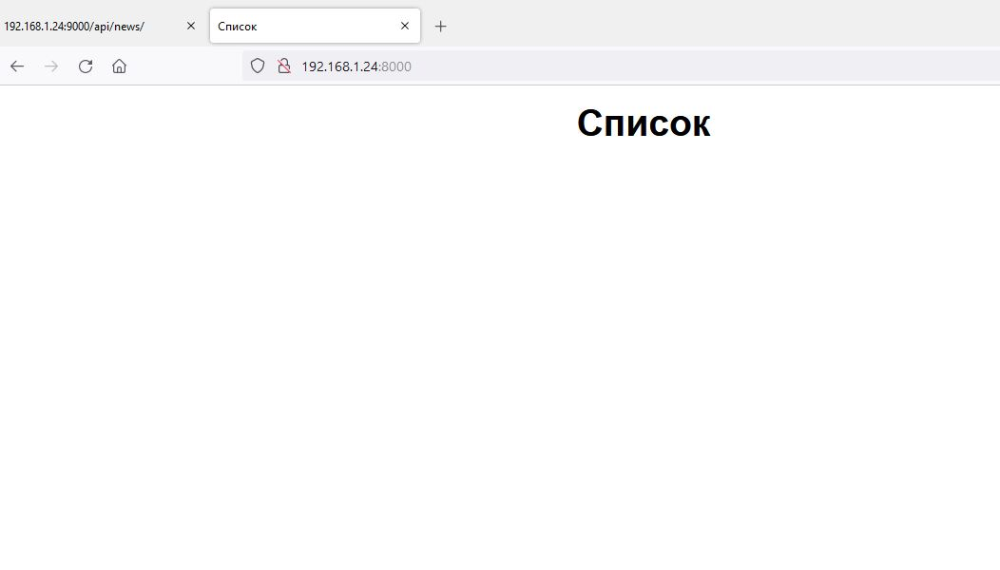
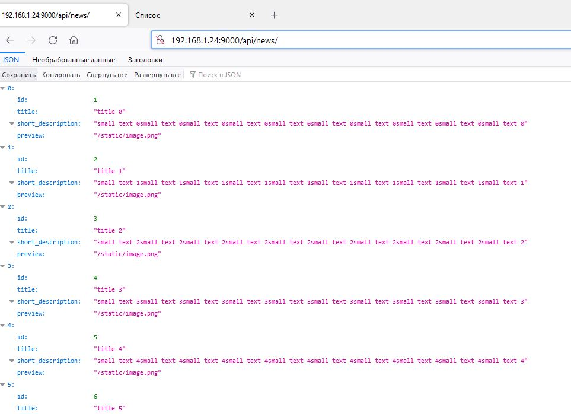

#  Домашнее задание к занятию "13.1 контейнеры, поды, deployment, statefulset, services, endpoints"

##  Задание 1: подготовить тестовый конфиг для запуска приложения

```
root@node1:~/pods/13-1# kubectl create namespace stage
namespace/stage created
```
- front-back.yaml
```
apiVersion: apps/v1
kind: Deployment
metadata:
  name: front-back
  namespace: stage
  labels:
    app: front-back
spec:
  replicas: 1
  selector:
    matchLabels:
      app: front-back
  template:
    metadata:
      labels:
        app: front-back
    spec:
      containers:
        - image: jay15/13-frontend
          imagePullPolicy: IfNotPresent
          name: frontend
          ports:
          - containerPort: 80
          env:
          - name: BASE_URL
            value: http://localhost:9000
        - image: jay15/13-backend
          imagePullPolicy: IfNotPresent
          name: backend
          ports:
          - containerPort: 9000
          env:
          - name: DATABASE_URL
            value: postgres://postgres:postgres@db:5432/news
      terminationGracePeriodSeconds: 30

---
apiVersion: v1
kind: Service
metadata:
  name: front-back
  namespace: stage
spec:
  ports:
    - name: web
      protocol: TCP
      port: 8080
      targetPort: 80
    - name: back
      protocol: TCP
      port: 9000
      targetPort: 9000
  selector:
    app: front-back
```
- db.yaml
```
apiVersion: apps/v1
kind: StatefulSet
metadata:
  name: db
  namespace: stage
spec:
  selector:
    matchLabels:
      app: db
  serviceName: "db"
  replicas: 1
  template:
    metadata:
      labels:
        app: db
    spec:
      containers:
      - name: db
        image: postgres:13-alpine
        ports:
        - containerPort: 5432
        env:
          - name: POSTGRES_PASSWORD
            value: postgres
          - name: POSTGRES_USER
            value: postgres
          - name: POSTGRES_DB
            value: news
      terminationGracePeriodSeconds: 30

---
apiVersion: v1
kind: Service
metadata:
  name: db
  namespace: stage
spec:
  ports:
    - protocol: TCP
      port: 5432
      targetPort: 5432
  selector:
    app: db
```

```
root@node1:~/pods# kubectl get po,deployment,svc,ep -n stage
NAME                             READY   STATUS    RESTARTS   AGE
pod/db-0                         1/1     Running   0          52m
pod/front-back-568b89674-wd4dh   2/2     Running   0          42m

NAME                         READY   UP-TO-DATE   AVAILABLE   AGE
deployment.apps/front-back   1/1     1            1           56m

NAME                 TYPE        CLUSTER-IP      EXTERNAL-IP   PORT(S)             AGE
service/db           ClusterIP   10.233.45.111   <none>        5432/TCP            53m
service/front-back   ClusterIP   10.233.30.93    <none>        8080/TCP,9000/TCP   56m

NAME                   ENDPOINTS                             AGE
endpoints/db           10.233.105.11:5432                    53m
endpoints/front-back   10.233.105.13:80,10.233.105.13:9000   56m

```
```
root@node1:~/pods# kubectl port-forward --address 192.168.1.24 -n stage service/front-back 8000:8080 9000:9000
Forwarding from 192.168.1.24:8000 -> 80
Forwarding from 192.168.1.24:9000 -> 9000
```
- Проверяем


```
root@node1:~/pods/12-5# kubectl exec -n stage hello-node-54b4c4cf44-nrrpp -- curl -s -m 1 front-back:8080
<!DOCTYPE html>
<html lang="ru">
<head>
    <title>Список</title>
    <meta charset="UTF-8">
    <meta name="viewport" content="width=device-width, initial-scale=1.0">
    <link href="/build/main.css" rel="stylesheet">
</head>
<body>
    <main class="b-page">
        <h1 class="b-page__title">Список</h1>
        <div class="b-page__content b-items js-list"></div>
    </main>
    <script src="/build/main.js"></script>
</body>
```
```
root@node1:~/pods/13-1# kubectl exec -n stage hello-node-54b4c4cf44-nrrpp -- curl -s -m 1 front-back:9000/api/news/
[{"id":1,"title":"title 0","short_description":"small text 0small text 0small text 0small text 0small text 0small text 0small text 0small text 0small text 0small text 0","preview":"/static/image.png"},{"id":2,"title":"title 1","short_description":"small text 1small text 1small text 1small text 1small text 1small text 1small text 1small text 1small text 1small text 1","preview":"/static/image.png"},{"id":3,"title":"title 2","short_description":"small text 2small text 2small text 2small text 2small text 2small text 2small text 2small text 2small text 2small text 2","preview":"/static/image.png"},{"id":4,"title":"title 3","short_description":"small text 3small text 3small text 3small text 3small text 3small text 3small text 3small text 3small text 3small text 3","preview":"/static/image.png"},{"id":5,"title":"title 4","short_description":"small text 4small text 4small text 4small text 4small text 4small text 4small text 4small text 4small text 4small text 4","preview":"/static/image.png"},{"id":6,"title":"title 5","short_description":"small text 5small text 5small text 5small text 5small text 5small text 5small text 5small text 5small text 5small text 5","preview":"/static/image.png"},{"id":7,"title":"title 6","short_description":"small text 6small text 6small text 6small text 6small text 6small text 6small text 6small text 6small text 6small text 6","preview":"/static/image.png"},{"id":8,"title":"title 7","short_description":"small text 7small text 7small text 7small text 7small text 7small text 7small text 7small text 7small text 7small text 7","preview":"/static/image.png"},{"id":9,"title":"title 8","short_description":"small text 8small text 8small text 8small text 8small text 8small text 8small text 8small text 8small text 8small text 8","preview":"/static/image.png"},{"id":10,"title":"title 9","short_description":"small text 9small text 9small text 9small text 9small text 9small text 9small text 9small text 9small text 9small text 9","preview":"/static/image.png"},{"id":11,"title":"title 10","short_description":"small text 10small text 10small text 10small text 10small text 10small text 10small text 10small text 10small text 10small text 10","preview":"/static/image.png"},{"id":12,"title":"title 11","short_description":"small text 11small text 11small text 11small text 11small text 11small text 11small text 11small text 11small text 11small text 11","preview":"/static/image.png"},{"id":13,"title":"title 12","short_description":"small text 12small text 12small text 12small text 12small text 12small text 12small text 12small text 12small text 12small text 12","preview":"/static/image.png"},{"id":14,"title":"title 13","short_description":"small text 13small text 13small text 13small text 13small text 13small text 13small text 13small text 13small text 13small text 13","preview":"/static/image.png"},{"id":15,"title":"title 14","short_description":"small text 14small text 14small text 14small text 14small text 14small text 14small text 14small text 14small text 14small text 14","preview":"/static/image.png"},{"id":16,"title":"title 15","short_description":"small text 15small text 15small text 15small text 15small text 15small text 15small text 15small text 15small text 15small text 15","preview":"/static/image.png"},{"id":17,"title":"title 16","short_description":"small text 16small text 16small text 16small text 16small text 16small text 16small text 16small text 16small text 16small text 16","preview":"/static/image.png"},{"id":18,"title":"title 17","short_description":"small text 17small text 17small text 17small text 17small text 17small text 17small text 17small text 17small text 17small text 17","preview":"/static/image.png"},{"id":19,"title":"title 18","short_description":"small text 18small text 18small text 18small text 18small text 18small text 18small text 18small text 18small text 18small text 18","preview":"/static/image.png"},{"id":20,"title":"title 19","short_description":"small text 19small text 19small text 19small text 19small text 19small text 19small text 19small text 19small text 19small text 19","preview":"/static/image.png"},{"id":21,"title":"title 20","short_description":"small text 20small text 20small text 20small text 20small text 20small text 20small text 20small text 20small text 20small text 20","preview":"/static/image.png"},{"id":22,"title":"title 21","short_description":"small text 21small text 21small text 21small text 21small text 21small text 21small text 21small text 21small text 21small text 21","preview":"/static/image.png"},{"id":23,"title":"title 22","short_description":"small text 22small text 22small text 22small text 22small text 22small text 22small text 22small text 22small text 22small text 22","preview":"/static/image.png"},{"id":24,"title":"title 23","short_description":"small text 23small text 23small text 23small text 23small text 23small text 23small text 23small text 23small text 23small text 23","preview":"/static/image.png"},{"id":25,"title":"title 24","short_description":"small text 24small text 24small text 24small text 24small text 24small text 24small text 24small text 24small text 24small text 24","preview":"/static/image.png"}]
```

```
root@node1:~/pods/13-1# kubectl exec -n stage hello-node-54b4c4cf44-nrrpp -- curl -s -m 1 front-back:9000/api/news/1
{"id":1,"title":"title 0","short_description":"small text 0small text 0small text 0small text 0small text 0small text 0small text 0small text 0small text 0small text 0","description":"0 some more text, 0 some more text, 0 some more text, 0 some more text, 0 some more text, 0 some more text, 0 some more text, 0 some more text, 0 some more text, 0 some more text, 0 some more text, 0 some more text, 0 some more text, 0 some more text, 0 some more text, 0 some more text, 0 some more text, 0 some more text, 0 some more text, 0 some more text, 0 some more text, 0 some more text, 0 some more text, 0 some more text, 0 some more text, 0 some more text, 0 some more text, 0 some more text, 0 some more text, 0 some more text, 0 some more text, 0 some more text, 0 some more text, 0 some more text, 0 some more text, 0 some more text, 0 some more text, 0 some more text, 0 some more text, 0 some more text, 0 some more text, 0 some more text, 0 some more text, 0 some more text, 0 some more text, 0 some more text, 0 some more text, 0 some more text, 0 some more text, 0 some more text, 0 some more text, 0 some more text, 0 some more text, 0 some more text, 0 some more text, 0 some more text, 0 some more text, 0 some more text, 0 some more text, 0 some more text, 0 some more text, 0 some more text, 0 some more text, 0 some more text, 0 some more text, 0 some more text, 0 some more text, 0 some more text, 0 some more text, 0 some more text, 0 some more text, 0 some more text, 0 some more text, 0 some more text, 0 some more text, 0 some more text, 0 some more text, 0 some more text, 0 some more text, 0 some more text, 0 some more text, 0 some more text, 0 some more text, 0 some more text, 0 some more text, 0 some more text, 0 some more text, 0 some more text, 0 some more text, 0 some more text, 0 some more text, 0 some more text, 0 some more text, 0 some more text, 0 some more text, 0 some more text, 0 some more text, 0 some more text, 0 some more text, 0 some more text, ","preview":"/static/image.png"}
```



##  Задание 2: подготовить конфиг для production окружения

```
root@node1:~/pods# kubectl create namespace production
namespace/production created
```
- frontend.yaml
```
apiVersion: apps/v1
kind: Deployment
metadata:
  name: frontend
  namespace: production
  labels:
    app: frontend
spec:
  replicas: 1
  selector:
    matchLabels:
      app: frontend
  template:
    metadata:
      labels:
        app: frontend
    spec:
      containers:
        - image: jay15/13-frontend
          imagePullPolicy: IfNotPresent
          name: frontend
          ports:
          - containerPort: 80
          env:
          - name: BASE_URL
            value: http://backend:9000
      terminationGracePeriodSeconds: 30

---
apiVersion: v1
kind: Service
metadata:
  name: frontend
  namespace: production
spec:
  ports:
    - name: web
      protocol: TCP
      port: 8080
      targetPort: 80
  selector:
    app: frontend
```
- backend.yaml
```
apiVersion: apps/v1
kind: Deployment
metadata:
  name: backend
  namespace: production
  labels:
    app: backend
spec:
  replicas: 1
  selector:
    matchLabels:
      app: backend
  template:
    metadata:
      labels:
        app: backend
    spec:
      containers:
        - image: jay15/13-backend
          imagePullPolicy: IfNotPresent
          name: backend
          ports:
          - containerPort: 9000
          env:
          - name: DATABASE_URL
            value: postgres://postgres:postgres@db:5432/news
      terminationGracePeriodSeconds: 30

---
apiVersion: v1
kind: Service
metadata:
  name: backend
  namespace: production
spec:
  ports:
    - name: back
      protocol: TCP
      port: 9000
      targetPort: 9000
  selector:
    app: backend
```
- db.yaml
```
apiVersion: apps/v1
kind: StatefulSet
metadata:
  name: db
  namespace: production
spec:
  selector:
    matchLabels:
      app: db
  serviceName: "db"
  replicas: 1
  template:
    metadata:
      labels:
        app: db
    spec:
      containers:
      - name: db
        image: postgres:13-alpine
        ports:
        - containerPort: 5432
        env:
          - name: POSTGRES_PASSWORD
            value: postgres
          - name: POSTGRES_USER
            value: postgres
          - name: POSTGRES_DB
            value: news
      terminationGracePeriodSeconds: 30

---
apiVersion: v1
kind: Service
metadata:
  name: db
  namespace: production
spec:
  ports:
    - protocol: TCP
      port: 5432
      targetPort: 5432
  selector:
    app: db
```

```
root@node1:~/pods/13-1# kubectl get po,deployment,svc,ep -n production
NAME                            READY   STATUS    RESTARTS   AGE
pod/backend-5f7c8f87c4-rrlln    1/1     Running   0          10m
pod/db-0                        1/1     Running   0          10m
pod/frontend-58565b8999-zgjnt   1/1     Running   0          10m

NAME                       READY   UP-TO-DATE   AVAILABLE   AGE
deployment.apps/backend    1/1     1            1           10m
deployment.apps/frontend   1/1     1            1           10m

NAME               TYPE        CLUSTER-IP      EXTERNAL-IP   PORT(S)    AGE
service/backend    ClusterIP   10.233.3.68     <none>        9000/TCP   10m
service/db         ClusterIP   10.233.15.217   <none>        5432/TCP   10m
service/frontend   ClusterIP   10.233.36.220   <none>        8080/TCP   10m

NAME                 ENDPOINTS            AGE
endpoints/backend    10.233.92.5:9000     10m
endpoints/db         10.233.105.18:5432   10m
endpoints/frontend   10.233.105.19:80     10m
```

```
root@node1:~/pods/13-1# kubectl port-forward --address 192.168.1.24 -n production service/frontend 8000:8080
Forwarding from 192.168.1.24:8000 -> 80

root@node1:~/pods/13-1/production# kubectl port-forward --address 192.168.1.24 -n production service/backend 9000:9000
Forwarding from 192.168.1.24:9000 -> 9000
```
- Проверяем



##  Задание 3 (*): добавить endpoint на внешний ресурс api

- Добавил endpoint направленный на elastic в моей локальной сети
- endpoint.yaml
```
---
apiVersion: v1
kind: Service
metadata:
  name: ext-api
  namespace: production
spec:
 ports:
    - protocol: TCP
      port: 9200
      targetPort: 9200
      name: ext-api

---
apiVersion: v1
kind: Endpoints
metadata:
  name: ext-api
  namespace: production
subsets:
  - addresses:
      - ip: 192.168.1.19
    ports:
      - port: 9200
        name: ext-api
```
```
root@node1:~/pods/13-1# kubectl get po,deployment,svc,ep -n production
NAME                            READY   STATUS    RESTARTS   AGE
pod/backend-85c6b986f9-f6lqd    1/1     Running   0          3h48m
pod/db-0                        1/1     Running   0          5h43m
pod/frontend-58565b8999-zgjnt   1/1     Running   0          5h43m

NAME                       READY   UP-TO-DATE   AVAILABLE   AGE
deployment.apps/backend    1/1     1            1           5h43m
deployment.apps/frontend   1/1     1            1           5h43m

NAME               TYPE        CLUSTER-IP      EXTERNAL-IP   PORT(S)    AGE
service/backend    ClusterIP   10.233.3.68     <none>        9000/TCP   5h43m
service/db         ClusterIP   10.233.15.217   <none>        5432/TCP   5h43m
service/ext-api    ClusterIP   10.233.52.244   <none>        9200/TCP   3h48m
service/frontend   ClusterIP   10.233.36.220   <none>        8080/TCP   5h43m

NAME                 ENDPOINTS            AGE
endpoints/backend    10.233.92.6:9000     5h43m
endpoints/db         10.233.105.18:5432   5h43m
endpoints/ext-api    192.168.1.19:9200    3h48m
endpoints/frontend   10.233.105.19:80     5h43m
```
- Проверяем

```root@node1:~/pods/13-1# kubectl exec -n production frontend-58565b8999-zgjnt  -- curl -s -m 1 ext-api:9200/_cat/indices?v
health status index                           uuid                   pri rep docs.count docs.deleted store.size pri.store.size
green  open   .geoip_databases                NVJC3g45Spi9JdrYvsYNxw   1   0         42           18     51.6mb         51.6mb
green  open   .kibana_7.16.3_001              S6nit7IySc-lLy230xjpCw   1   0         18            4      2.3mb          2.3mb
green  open   .apm-custom-link                1njH8sZURouOQAAANbPAuw   1   0          0            0       226b           226b
yellow open   vector-2022.01.28               D993laLYTq-qNkAehKSu4g   1   1        280            0    126.2kb        126.2kb
green  open   .apm-agent-configuration        s961y85gRBysxO_TEViD2A   1   0          0            0       226b           226b
green  open   .kibana_task_manager_7.16.3_001 LsMa26ldSweqaaDMXw8Sgw   1   0         17          702    194.3kb        194.3kb
green  open   .tasks                          oLGdkL4SQBKETaTDOhvByw   1   0         23            1       70kb           70kb
```