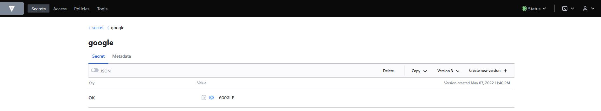

#  Домашнее задание к занятию "14.2 Синхронизация секретов с внешними сервисами. Vault"

##  Задача 1: Работа с модулем Vault

- kubectl apply -f 14.2/vault-pod.yml
```
root@node1:~/14-2# kubectl apply -f vault-pod.yml
pod/14.2-netology-vault created
```
- apt install jq
- kubectl get pod 14.2-netology-vault -o json | jq -c '.status.podIPs'
```
root@node1:~/14-2# kubectl get pod 14.2-netology-vault -o json | jq -c '.status.podIPs'
[{"ip":"10.233.105.47"}]
```
- kubectl run -i --tty fedora --image=fedora --restart=Never -- sh
```
root@node1:~/14-2# kubectl run -i --tty fedora --image=fedora --restart=Never -- sh
If you don't see a command prompt, try pressing enter.
sh-5.1# dnf -y install pip
Fedora 35 - x86_64                                                                                                                                                  6.8 MB/s |  79 MB     00:11
Fedora 35 openh264 (From Cisco) - x86_64                                                                                                                            1.7 kB/s | 2.5 kB     00:01
Fedora Modular 35 - x86_64                                                                                                                                          2.4 MB/s | 3.3 MB     00:01
Fedora 35 - x86_64 - Updates                                                                                                                                        5.7 MB/s |  29 MB     00:05
Fedora Modular 35 - x86_64 - Updates                                                                                                                                1.7 MB/s | 2.9 MB     00:01
Dependencies resolved.
====================================================================================================================================================================================================
 Package                                               Architecture                              Version                                           Repository                                  Size
====================================================================================================================================================================================================
Installing:
 python3-pip                                           noarch                                    21.2.3-4.fc35                                     updates                                    1.8 M
Installing weak dependencies:
 libxcrypt-compat                                      x86_64                                    4.4.28-1.fc35                                     updates                                     89 k
 python3-setuptools                                    noarch                                    57.4.0-1.fc35                                     fedora                                     928 k

Transaction Summary
====================================================================================================================================================================================================
Install  3 Packages

Total download size: 2.8 M
Installed size: 14 M
Downloading Packages:
(1/3): libxcrypt-compat-4.4.28-1.fc35.x86_64.rpm                                                                                                                    276 kB/s |  89 kB     00:00
(2/3): python3-pip-21.2.3-4.fc35.noarch.rpm                                                                                                                         1.8 MB/s | 1.8 MB     00:00
(3/3): python3-setuptools-57.4.0-1.fc35.noarch.rpm                                                                                                                  891 kB/s | 928 kB     00:01
----------------------------------------------------------------------------------------------------------------------------------------------------------------------------------------------------
Total                                                                                                                                                               1.3 MB/s | 2.8 MB     00:02
Running transaction check
Transaction check succeeded.
Running transaction test
Transaction test succeeded.
Running transaction
  Preparing        :                                                                                                                                                                            1/1
  Installing       : libxcrypt-compat-4.4.28-1.fc35.x86_64                                                                                                                                      1/3
  Installing       : python3-setuptools-57.4.0-1.fc35.noarch                                                                                                                                    2/3
  Installing       : python3-pip-21.2.3-4.fc35.noarch                                                                                                                                           3/3
  Running scriptlet: python3-pip-21.2.3-4.fc35.noarch                                                                                                                                           3/3
  Verifying        : python3-setuptools-57.4.0-1.fc35.noarch                                                                                                                                    1/3
  Verifying        : libxcrypt-compat-4.4.28-1.fc35.x86_64                                                                                                                                      2/3
  Verifying        : python3-pip-21.2.3-4.fc35.noarch                                                                                                                                           3/3

Installed:
  libxcrypt-compat-4.4.28-1.fc35.x86_64                             python3-pip-21.2.3-4.fc35.noarch                             python3-setuptools-57.4.0-1.fc35.noarch

Complete!
sh-5.1# pip install hvac
Collecting hvac
  Downloading hvac-0.11.2-py2.py3-none-any.whl (148 kB)
     |████████████████████████████████| 148 kB 5.6 MB/s
Collecting six>=1.5.0
  Downloading six-1.16.0-py2.py3-none-any.whl (11 kB)
Collecting requests>=2.21.0
  Downloading requests-2.27.1-py2.py3-none-any.whl (63 kB)
     |████████████████████████████████| 63 kB 198 kB/s
Collecting charset-normalizer~=2.0.0
  Downloading charset_normalizer-2.0.12-py3-none-any.whl (39 kB)
Collecting idna<4,>=2.5
  Downloading idna-3.3-py3-none-any.whl (61 kB)
     |████████████████████████████████| 61 kB 480 kB/s
Collecting certifi>=2017.4.17
  Downloading certifi-2021.10.8-py2.py3-none-any.whl (149 kB)
     |████████████████████████████████| 149 kB 14.0 MB/s
Collecting urllib3<1.27,>=1.21.1
  Downloading urllib3-1.26.9-py2.py3-none-any.whl (138 kB)
     |████████████████████████████████| 138 kB 13.9 MB/s
Installing collected packages: urllib3, idna, charset-normalizer, certifi, six, requests, hvac
Successfully installed certifi-2021.10.8 charset-normalizer-2.0.12 hvac-0.11.2 idna-3.3 requests-2.27.1 six-1.16.0 urllib3-1.26.9
WARNING: Running pip as the 'root' user can result in broken permissions and conflicting behaviour with the system package manager. It is recommended to use a virtual environment instead: https://pip.pypa.io/warnings/venv
>>> import hvac
>>> client = hvac.Client(
...     url='http://10.233.105.47:8200',
...     token='aiphohTaa0eeHei'
... )
>>> client.is_authenticated()
True
>>>
>>> client.secrets.kv.v2.create_or_update_secret(
...     path='hvac',
...     secret=dict(netology='Big secret!!!'),
... )
{'request_id': '37b545ff-794d-2827-8dce-c81da2eb0dea', 'lease_id': '', 'renewable': False, 'lease_duration': 0, 'data': {'created_time': '2022-04-24T11:13:02.658875357Z', 'custom_metadata': None, 'deletion_time': '', 'destroyed': False, 'version': 2}, 'wrap_info': None, 'warnings': None, 'auth': None}
>>> client.secrets.kv.v2.read_secret_version(
...     path='hvac',
... )
{'request_id': '98806334-8653-b93b-a65b-b24afa574843', 'lease_id': '', 'renewable': False, 'lease_duration': 0, 'data': {'data': {'netology': 'Big secret!!!'}, 'metadata': {'created_time': '2022-04-24T11:13:02.658875357Z', 'custom_metadata': None, 'deletion_time': '', 'destroyed': False, 'version': 2}}, 'wrap_info': None, 'warnings': None, 'auth': None}
```

##  Задача 2 (*): Работа с секретами внутри модуля

- Соберем докер образ из файла [fedora-14-2](build/fedora-14-2)
```
docker docker build -t jay15/fedora-hvac:latest -f fedora-hvac-14-2 .
Sending build context to Docker daemon  3.584kB
Step 1/7 : FROM fedora:latest
 ---> b97d90f26110
Step 2/7 : RUN dnf -y install pip jq
 ---> Running in 4bd33954bb97
Fedora 35 - x86_64                              4.8 MB/s |  79 MB     00:16
Fedora 35 openh264 (From Cisco) - x86_64        1.5 kB/s | 2.5 kB     00:01
Fedora Modular 35 - x86_64                      2.1 MB/s | 3.3 MB     00:01
Fedora 35 - x86_64 - Updates                    2.8 MB/s |  29 MB     00:10
Fedora Modular 35 - x86_64 - Updates            2.5 MB/s | 2.9 MB     00:01
Dependencies resolved.
================================================================================
 Package                 Arch        Version                 Repository    Size
================================================================================
Installing:
 jq                      x86_64      1.6-10.fc35             fedora       186 k
 python3-pip             noarch      21.2.3-4.fc35           updates      1.8 M
Installing dependencies:
 oniguruma               x86_64      6.9.7.1-1.fc35.1        fedora       217 k
Installing weak dependencies:
 libxcrypt-compat        x86_64      4.4.28-1.fc35           updates       89 k
 python3-setuptools      noarch      57.4.0-1.fc35           fedora       928 k

Transaction Summary
================================================================================
Install  5 Packages

Total download size: 3.2 M
Installed size: 15 M
Downloading Packages:
(1/5): oniguruma-6.9.7.1-1.fc35.1.x86_64.rpm    630 kB/s | 217 kB     00:00
(2/5): jq-1.6-10.fc35.x86_64.rpm                461 kB/s | 186 kB     00:00
(3/5): libxcrypt-compat-4.4.28-1.fc35.x86_64.rp 347 kB/s |  89 kB     00:00
(4/5): python3-setuptools-57.4.0-1.fc35.noarch. 1.3 MB/s | 928 kB     00:00
(5/5): python3-pip-21.2.3-4.fc35.noarch.rpm     1.6 MB/s | 1.8 MB     00:01
--------------------------------------------------------------------------------
Total                                           1.1 MB/s | 3.2 MB     00:02
Running transaction check
Transaction check succeeded.
Running transaction test
Transaction test succeeded.
Running transaction
  Preparing        :                                                        1/1
  Installing       : libxcrypt-compat-4.4.28-1.fc35.x86_64                  1/5
  Installing       : python3-setuptools-57.4.0-1.fc35.noarch                2/5
  Installing       : oniguruma-6.9.7.1-1.fc35.1.x86_64                      3/5
  Installing       : jq-1.6-10.fc35.x86_64                                  4/5
  Installing       : python3-pip-21.2.3-4.fc35.noarch                       5/5
  Running scriptlet: python3-pip-21.2.3-4.fc35.noarch                       5/5
  Verifying        : jq-1.6-10.fc35.x86_64                                  1/5
  Verifying        : oniguruma-6.9.7.1-1.fc35.1.x86_64                      2/5
  Verifying        : python3-setuptools-57.4.0-1.fc35.noarch                3/5
  Verifying        : libxcrypt-compat-4.4.28-1.fc35.x86_64                  4/5
  Verifying        : python3-pip-21.2.3-4.fc35.noarch                       5/5

Installed:
  jq-1.6-10.fc35.x86_64                   libxcrypt-compat-4.4.28-1.fc35.x86_64
  oniguruma-6.9.7.1-1.fc35.1.x86_64       python3-pip-21.2.3-4.fc35.noarch
  python3-setuptools-57.4.0-1.fc35.noarch

Complete!
Removing intermediate container 4bd33954bb97
 ---> f7034fbbbfaf
Step 3/7 : RUN pip install -q hvac
 ---> Using cache
 ---> db3797f38f93
Step 4/7 : COPY ./secret /secret
 ---> e533835a2cb9
Step 5/7 : RUN chmod +x /secret/secret-hvac.py
 ---> Running in aef886cc5cf2
Removing intermediate container aef886cc5cf2
 ---> 243e9567a055
Step 6/7 : EXPOSE 8200
 ---> Running in 008c18a4cd15
Removing intermediate container 008c18a4cd15
 ---> 26f91a2514aa
Step 7/7 : CMD ["python3", "/secret/secret-hvac.py"]
 ---> Running in 4e205ba7e765
Removing intermediate container 4e205ba7e765
 ---> 0363a3b2cada
Successfully built 0363a3b2cada
Successfully tagged jay15/fedora-hvac:latest
```
- Запушим на docker hub
```
docker push jay15/fedora-hvac:latest
The push refers to repository [docker.io/jay15/fedora-hvac]
3d4b3a0afe3a: Pushed
3079cff7e891: Pushed
02250595e006: Pushed
1ee8b4fe7866: Pushed
5b86cbe1caa0: Mounted from library/fedora
latest: digest: sha256:0cad18ed143c9fa67fa67d817d0ecde98f2ae7e5b79b2e61222fe0f697258fa1 size: 1367
```
- Создадим поды из манифестов [manifests](manifests/)
```
kubectl apply -f 14-2/
deployment.apps/vault created
service/vault created
configmap/secret-hvac created
deployment.apps/test-secret-hvac created
```
- Проверим созданные секреты
```
curl -s --header "X-Vault-Token: aiphohTaa0eeHei" http://vault:8200/v1/secret/data/google| jq '.data'
{
  "data": {
    "OK": "GOOGLE"
  },
  "metadata": {
    "created_time": "2022-05-07T20:54:52.520539309Z",
    "custom_metadata": null,
    "deletion_time": "",
    "destroyed": false,
    "version": 7
  }
}
```


- Как видим, секрет успешно был записан в Vault.