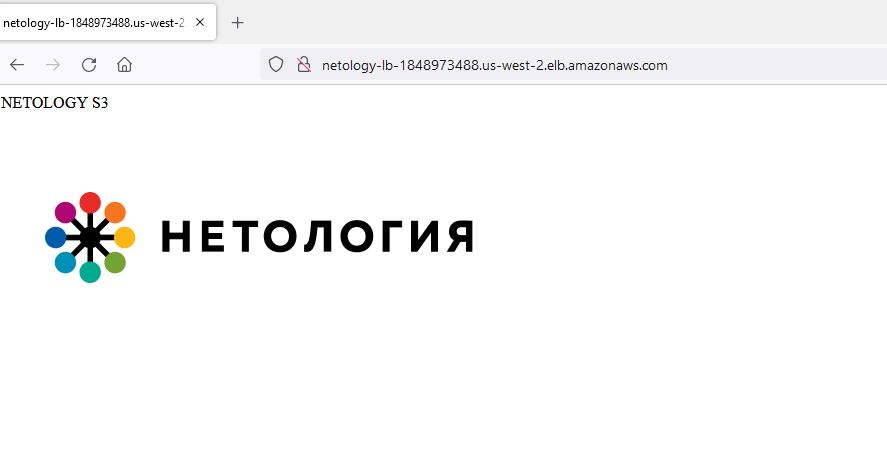

#  Домашнее задание к занятию 15.2 "Вычислительные мощности. Балансировщики нагрузки".

##  Задание 1. Яндекс.Облако (обязательное к выполнению)

- т.к. у меня нет возможности выполнять задания на ЯО, по согласованию с кураторами курса, буду выполнять только задания со звездочкой на AWS

##  Задание 2*. AWS (необязательное к выполнению)

Используя конфигурации, выполненные в рамках ДЗ на предыдущем занятии, добавить к Production like сети Autoscaling group из 3 EC2-инстансов с автоматической установкой web-сервера в private домен.

1. Создать bucket S3 и разместить там файл с картинкой:
- Создать bucket в S3 с произвольным именем (например, имя_студента_дата);
- Положить в bucket файл с картинкой;
- Сделать доступным из Интернета.
2. Сделать Launch configurations с использованием bootstrap скрипта с созданием веб-странички на которой будет ссылка на картинку в S3.
3. Загрузить 3 ЕС2-инстанса и настроить LB с помощью Autoscaling Group.

Пример bootstrap-скрипта:
```
#!/bin/bash
yum install httpd -y
service httpd start
chkconfig httpd on
cd /var/www/html
echo "<html><h1>My cool web-server</h1></html>" > index.html
```

- ### Решение

Файла [terraform](./terraform/)

```
Apply complete! Resources: 23 added, 0 changed, 0 destroyed.

Outputs:

LB_DNS = "netology-lb-1848973488.us-west-2.elb.amazonaws.com"
```


- Картинка загрузилась, всё работает.