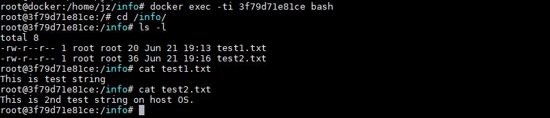

# Домашнее задание к занятию "5.3. Контейнеризация на примере Docker"

## Задача 1

Сценарий:

- Высоконагруженное монолитное java веб-приложение - лучше
использовать виртуальную машину, т.к. java очень требовательна к памяти
и может больше потреблять ресурсов в контейнере, чем ей выделено.
- Go-микросервис для генерации отчетов - подойдет docker т.к. не нужно ничего хранить и 
не требует много ресурсов.  
- Nodejs веб-приложение - подойдет docker т.к. не нужно ничего хранить и 
не требует много ресурсов.
- Мобильное приложение c версиями для Android и iOS - подойдет docker т.к. не нужно ничего хранить и 
не требует много ресурсов.
- База данных postgresql используемая, как кэш - скорее всего лучше запускать на физическом сервере 
или в виртульной машине т.к. нужно хранить данные.
- Шина данных на базе Apache Kafka - подойдет docker т.к. не нужно ничего хранить.
- Очередь для Logstash на базе Redis - скорее всего лучше запускать на физическом сервере 
или в виртульной машине т.к. нужно хранить данные.
- Elastic stack для реализации логирования продуктивного веб-приложения - три ноды elasticsearch, два logstash и две ноды kibana - 
возможно нужно разделить: 
  
  elasticsearch - хранить в виртуалке т.к. надо хранить данные
  
  logstash и kibana - в doker
- Мониторинг-стек на базе prometheus и grafana - подойдет docker т.к. не нужно ничего хранить и 
не требует много ресурсов.
- Mongodb, как основное хранилище данных для java-приложения - скорее всего лучше запускать на физическом сервере 
или в виртульной машине т.к. нужно хранить данные.
-  Jenkins-сервер - подойдет docker т.к. не нужно ничего хранить и 
не требует много ресурсов. 
   
## Задача 2

Вот ссылка на репозиторий https://hub.docker.com/repository/docker/jay15/apache-netology

## Задача 3

- Запуск Centos и проброс папки

- Запуск Debian и проброс папки

- Список запущенных контейнеров

Создание файла в контейнере

  
Список и содержимое файлов
