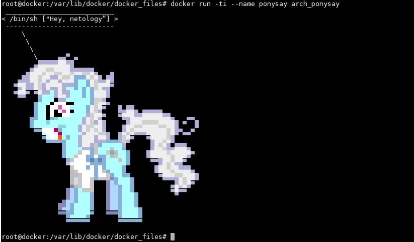
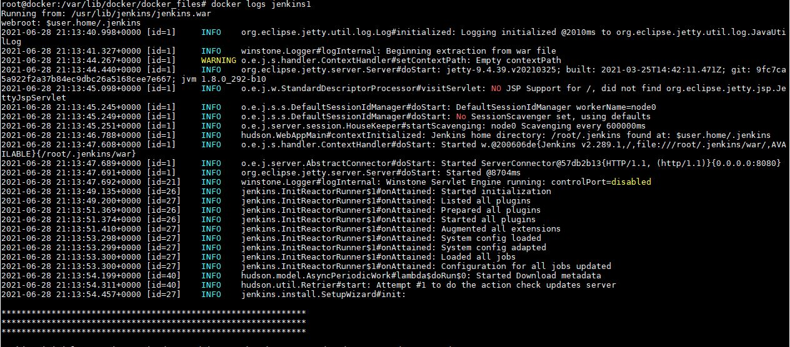
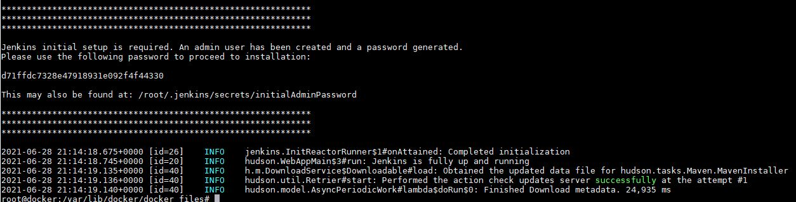
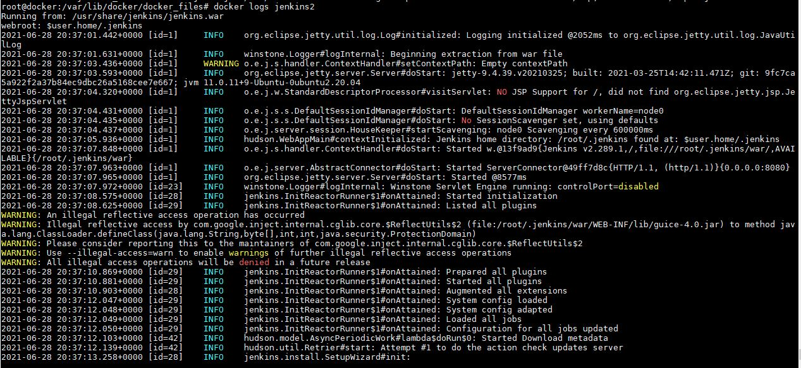
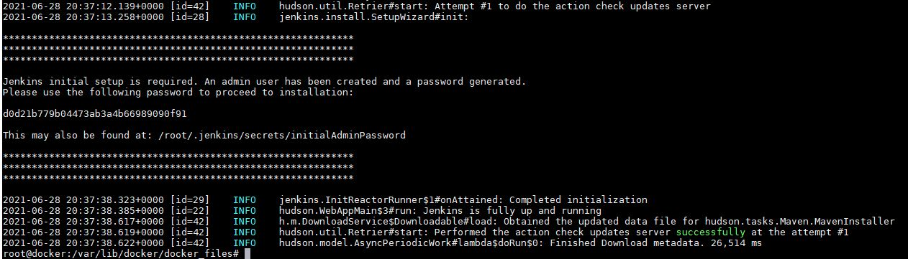
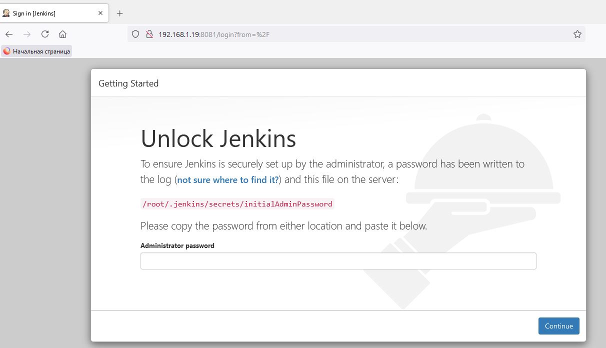
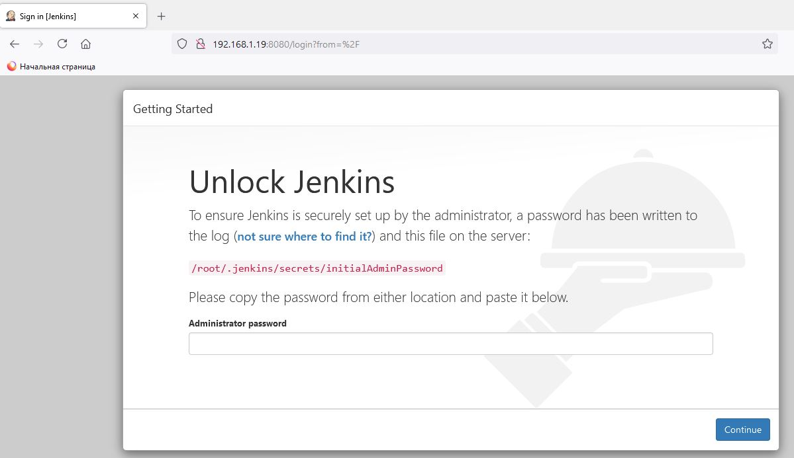
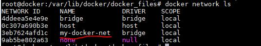
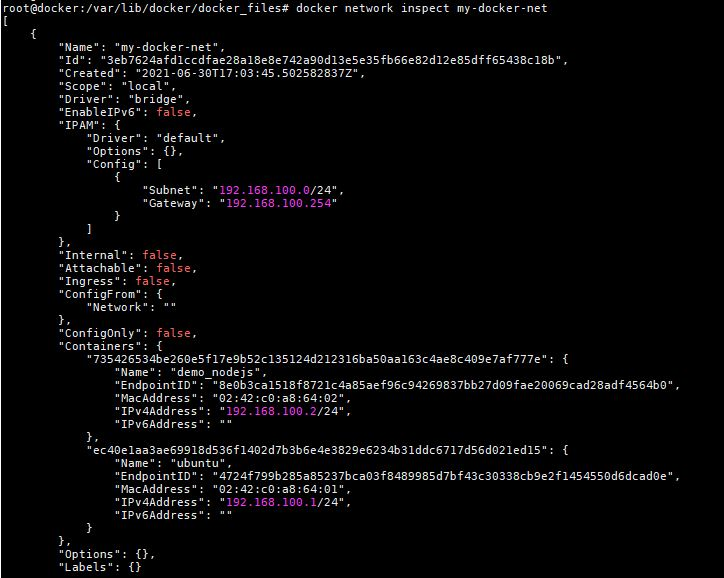
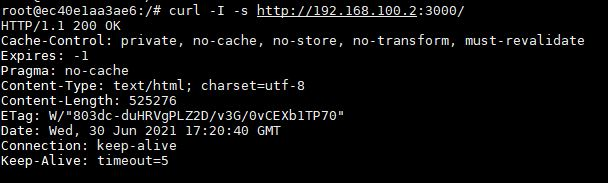

# Домашнее задание к занятию "5.4. Практические навыки работы с Docker"

## Задача 1

Сам Dockerfile
```
FROM    archlinux:latest

RUN     pacman -Syy

RUN     pacman -S --noconfirm ponysay

ENTRYPOINT ["/usr/bin/ponysay"]

CMD ["Hey, netology”]
```

Скриншот



Ссылка на docker-hub

https://hub.docker.com/repository/docker/jay15/arch_ponysay

## Задача 2

```
FROM    amazoncorretto:latest

RUN     yum upgrade && yum install -y wget sudo
RUN     wget -O /etc/yum.repos.d/jenkins.repo \
        https://pkg.jenkins.io/redhat-stable/jenkins.repo
RUN     rpm --import https://pkg.jenkins.io/redhat-stable/jenkins.io.key
RUN     yum upgrade && yum install -y jenkins

EXPOSE  8080

ENTRYPOINT ["java","-jar","/usr/lib/jenkins/jenkins.war"]

```

```
FROM    ubuntu:latest

RUN     apt-get update && apt-get install -y wget sudo gnupg
RUN     wget -q -O - https://pkg.jenkins.io/debian-stable/jenkins.io.key | sudo apt-key add -
RUN     echo "deb https://pkg.jenkins.io/debian-stable binary/" >> /etc/apt/sources.list
RUN     apt-get update && apt-get install -y openjdk-11-jdk jenkins

EXPOSE  8080

ENTRYPOINT ["java","-jar","/usr/share/jenkins/jenkins.war"]

```

Log jenkins_amazoncorretto



Log jenkins_ubuntu



Jenkins amazoncorretto


Jenkuns ubuntu


https://hub.docker.com/repository/docker/jay15/jenkins_amazoncorretto

https://hub.docker.com/repository/docker/jay15/jenkins_ubuntu

## Задача 3

Dockerfile с npm

```
FROM    node:latest

WORKDIR /var/www/node/

RUN     apt-get update
RUN     git clone https://github.com/simplicitesoftware/nodejs-demo.git

WORKDIR /var/www/node/nodejs-demo/

RUN     npm install

EXPOSE  3000

ENTRYPOINT      ["npm", "start", "0.0.0.0"]

```

docker network




curl

