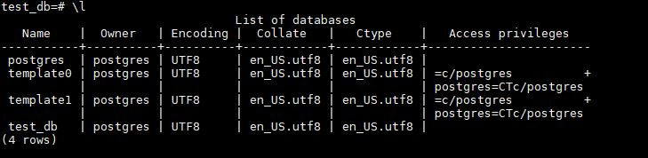
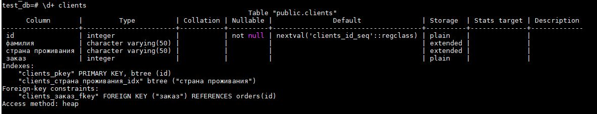
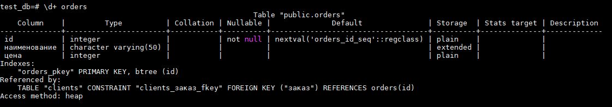
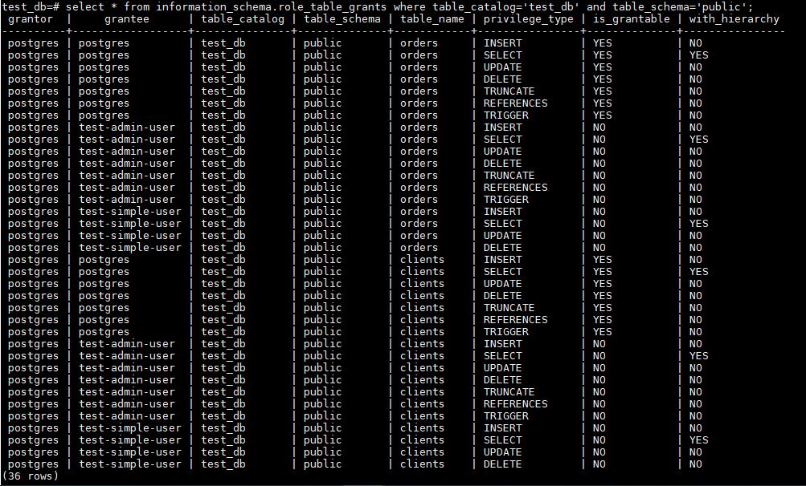

# Домашнее задание к занятию "6.2. SQL"

## Задача 1

docker-compose.yml
```
version: '2.3'

volumes:
  pg_data1:
  pg_backup:

services:
  pg_db1:
    build: .
    image: postgres:12

    volumes:
      - pg_data1:/var/lib/postgresql/data
      - pg_backup:/backup

    environment:
      - POSTGRES_USER=postgres
      - POSTGRES_PASSWORD=postgres

```

## Задача 2









## Задача 3

