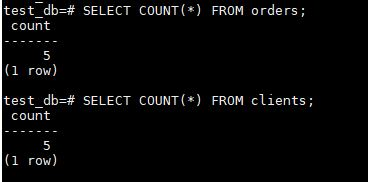
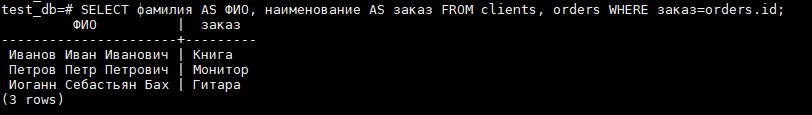
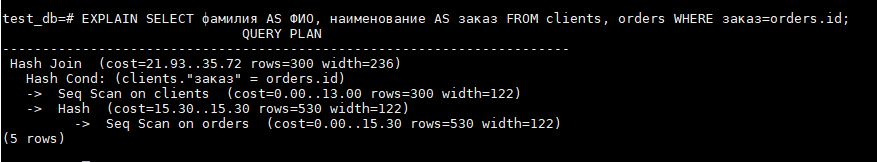
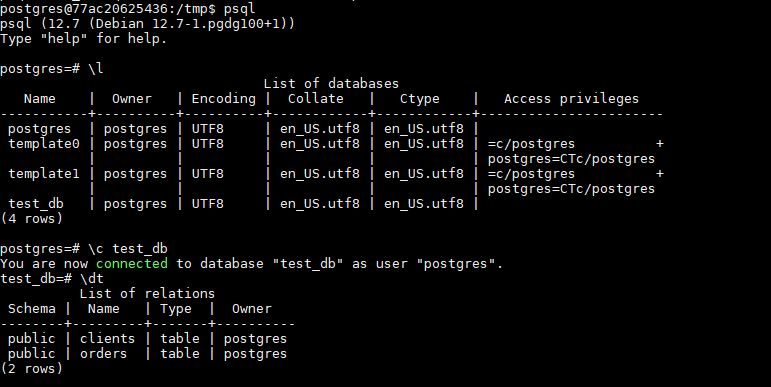
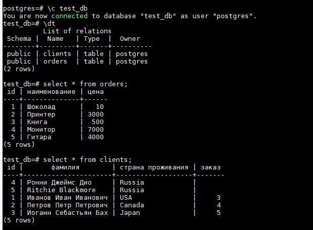

# Домашнее задание к занятию "6.2. SQL"

## Задача 1

docker-compose.yml
```
version: '2.3'

volumes:
  pg_data1:
  pg_backup:

services:
  pg_db1:
    build: .
    image: postgres:12

    volumes:
      - pg_data1:/var/lib/postgresql/data
      - pg_backup:/backup

    environment:
      - POSTGRES_USER=postgres
      - POSTGRES_PASSWORD=postgres

```

## Задача 2


## Задача 3




## Задача 4

```
UPDATE clients SET заказ = '3' where id = 1;

UPDATE clients SET заказ = '4' where id = 2;

UPDATE clients SET заказ = '5' where id = 3;
```




## Задача 5



С помощью EXPLAIN можно узнать, какой был выбран план запроса.
В выводе команды EXPLAIN для каждого узла в дереве плана отводится одна строка, 
где показывается базовый тип узла плюс оценка стоимости выполнения данного узла, 
которую сделал для него планировщик. 

Например (cost=21.93..35.72) Приблизительная стоимость запуска и приблизительная общая стоимость.
rows=300 width=236 Ожидаемое число строк и ожидаемый средний размер строк.
Оценка делается для каждого из этапов.


## Задача 6

Для бэкапа базы 

`pg_dump -C -d test_db > /backup/test_db.sql`

Для восстановления базы на другом контейнере

`psql -f test_db.sql`

Результат





