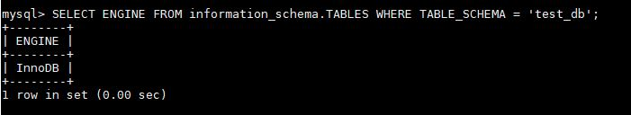

# Домашнее задание к занятию "6.3. MySQL"

## Задача 1

`mysql> status`

- mysql  Ver 8.0.25 for Linux on x86_64 (MySQL Community Server - GPL)

Количество записей с price > 300 

## Задача 2

## Задача 3

SHOW PROFILES;

|       12 | 0.62090750 | ALTER TABLE orders ENGINE = MyISAM 

|       14 | 0.82249600 | ALTER TABLE orders ENGINE = InnoDB 

## Задача 4

