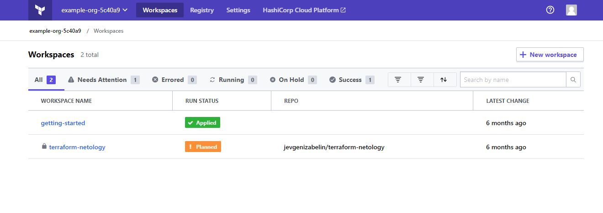
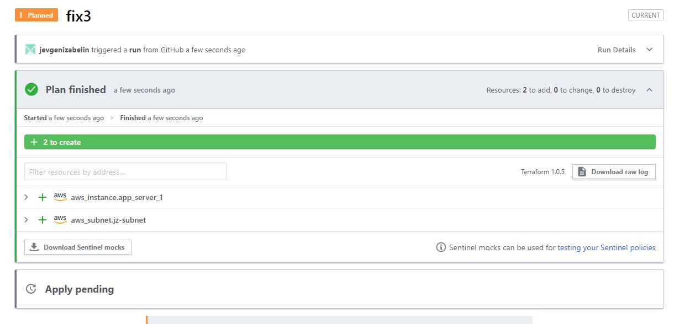
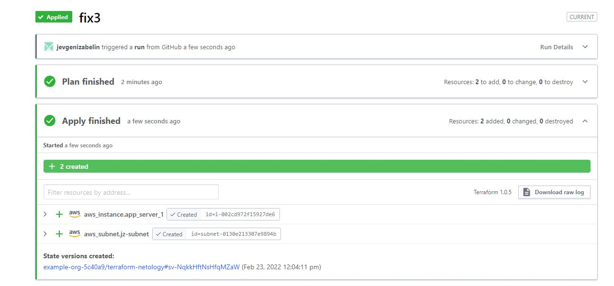

#  Домашнее задание к занятию "7.4. Средства командной работы над инфраструктурой."

##  Задача 1. Настроить terraform cloud (необязательно, но крайне желательно).

- Зарегистрировался на terraform cloud.
- Создал Workspace с названием terraform-netology.
- Зарегистрировал свой github репозиторий https://github.com/jevgenizabelin/terraform-netology в terraform cloud.
- Создар переменные окружения на terraform cloud для подключения к aws.
- Прописал конфигурацию в main.tf, сделал commit и push в репозиторий.
- На terraform cloud настроил только в автомате plan, apply оставил в ручном режиме.
- Вот скриншоты успешного plan и apply 

##  Задача 2. Написать серверный конфиг для атлантиса.

