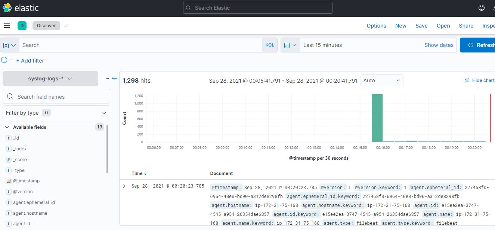

# Домашнее задание к занятию "8.4 Работа с Roles"

## Основная часть

2. `ansible-galaxy install -r requirements.yml -p roles`
```yaml
Starting galaxy role install process
- extracting elastic to /root/git-repos/netology-ansible_8_3/roles/elastic
- elastic (2.0.0) was installed successfully
```
3. `ansible-galaxy role init kibana-role`
```yaml
- Role kibana-role was created successfully
```
6. `ansible-galaxy role init filebeat-role`
```yaml
- Role filebeat-role was created successfully
```
9. 2 роли устанавливают Kibana и Filebeat.
   Установка происходит на хосты, указанные в файле inventory/prod/hosts.yml 
   и версией из файла inventory/prod/group_vars/all.yml,
   который переопределяет версию из /roles.
   Роли имеют install_type: remote.
   Роли имеют таски, которые проверяют поддерживаемую версию дистрибутива из файла /vars/main.yml,
   скачивают нужную версию пакета для определенного дистрибутива в локальную папку /files.
   Затем копирует файл на удаленный хост в папку /tmp и инсталирует пакет.
   Дальше идет конфигурация сервиса из темплейта, также сервис ставится в автозапуск.
   Для Filebeat дополнительно ещё включается модуль system и загружает Kibana dashboard. 
   Так же у каждого плея есть handlers, который перегружают сервисы.

11. `requirements.yml`
```yaml
---
  - src: git@github.com:netology-code/mnt-homeworks-ansible.git
    scm: git
    version: "2.0.0"
    name: elastic
  - src: git@github.com:jevgenizabelin/kibana-role.git
    scm: git
    version: "0.0.3"
    name: kibana_role
  - src: git@github.com:jevgenizabelin/filebeat-role.git
    scm: git
    version: "0.0.3"
    name: filebeat_role
```

12. `ansible-playbook site.yml -i inventory/prod/hosts.yml`
```yaml
PLAY [Install Elasticsearch] ******************************************************************************************************

TASK [Gathering Facts] ************************************************************************************************************
ok: [el-instance]

TASK [elastic : Fail if unsupported system detected] ******************************************************************************
skipping: [el-instance]

TASK [elastic : include_tasks] ****************************************************************************************************
included: /root/git-repos/netology-ansible_8_3/roles/elastic/tasks/download_apt.yml for el-instance

TASK [elastic : Download Elasticsearch's deb] *************************************************************************************
ok: [el-instance -> localhost]

TASK [elastic : Copy Elasticsearch to manage host] ********************************************************************************
ok: [el-instance]

TASK [elastic : include_tasks] ****************************************************************************************************
included: /root/git-repos/netology-ansible_8_3/roles/elastic/tasks/install_apt.yml for el-instance

TASK [elastic : Install Elasticsearch] ********************************************************************************************
ok: [el-instance]

TASK [elastic : Configure Elasticsearch] ******************************************************************************************
ok: [el-instance]

PLAY [Install Kibana] *************************************************************************************************************

TASK [Gathering Facts] ************************************************************************************************************
ok: [k-instance]

TASK [kibana_role : Fail if unsupported system detected] **************************************************************************
skipping: [k-instance]

TASK [kibana_role : include_tasks] ************************************************************************************************
included: /root/git-repos/netology-ansible_8_3/roles/kibana_role/tasks/download_apt.yml for k-instance

TASK [kibana_role : Download Kibana's deb] ****************************************************************************************
ok: [k-instance -> localhost]

TASK [kibana_role : Copy Kibana to manage host] ***********************************************************************************
ok: [k-instance]

TASK [kibana_role : include_tasks] ************************************************************************************************
included: /root/git-repos/netology-ansible_8_3/roles/kibana_role/tasks/install_apt.yml for k-instance

TASK [kibana_role : Install Kibana] ***********************************************************************************************
ok: [k-instance]

TASK [kibana_role : Configure Kibana] *********************************************************************************************
ok: [k-instance]

PLAY [Install Filebeat] ***********************************************************************************************************

TASK [Gathering Facts] ************************************************************************************************************
ok: [f-instance]

TASK [filebeat_role : Fail if unsupported system detected] ************************************************************************
skipping: [f-instance]

TASK [filebeat_role : include_tasks] **********************************************************************************************
included: /root/git-repos/netology-ansible_8_3/roles/filebeat_role/tasks/download_apt.yml for f-instance

TASK [filebeat_role : Download Filebeat's deb] ************************************************************************************
ok: [f-instance -> localhost]

TASK [filebeat_role : Copy Filebeat to manage host] *******************************************************************************
ok: [f-instance]

TASK [filebeat_role : include_tasks] **********************************************************************************************
included: /root/git-repos/netology-ansible_8_3/roles/filebeat_role/tasks/install_apt.yml for f-instance

TASK [filebeat_role : Install Filebeat] *******************************************************************************************
ok: [f-instance]

TASK [filebeat_role : Configure Filebeat] *****************************************************************************************
ok: [f-instance]

TASK [filebeat_role : Set Filebeat systemwork] ************************************************************************************
ok: [f-instance]

TASK [filebeat_role : Load Kibana dashboard] **************************************************************************************
ok: [f-instance]

RUNNING HANDLER [filebeat_role : restart Filebeat] ********************************************************************************
ok: [f-instance]

PLAY RECAP ************************************************************************************************************************
el-instance                : ok=7    changed=0    unreachable=0    failed=0    skipped=1    rescued=0    ignored=0
f-instance                 : ok=10    changed=0    unreachable=0    failed=0    skipped=1    rescued=0    ignored=0
k-instance                 : ok=7    changed=0    unreachable=0    failed=0    skipped=1    rescued=0    ignored=0
```
14. 
- https://github.com/jevgenizabelin/kibana-role/tree/0.0.4


- https://github.com/jevgenizabelin/filebeat-role/tree/0.0.3


- https://github.com/jevgenizabelin/netology-ansible_8_3/tree/0.0.2


## Необязательная часть

1. `ansible-galaxy role init logstash-role`
```yaml
- Role logstash-role was created successfully
```
3. Добавил роль logstash_role в свой плейбук, настроил связь между filebeat, logstash и elasticsearch.
Настроил на filebeat сбор логов syslog и auth.log
Настроил filter на logstash, который парсит эти логи и пишет в индекс `syslog-logs-%{+YYYY.MM}` на elastic.

`curl 'localhost:9200/_cat/indices?v'`
```yaml
health status index                             uuid                   pri rep docs.count docs.deleted store.size pri.store.size
green  open   .geoip_databases                  phvc8hjRTguPDzXWBp8-Wg   1   0         43            0     40.7mb         40.7mb
green  open   .apm-custom-link                  yQl4Om1uTtmN0KGUMvpTXg   1   0          0            0       208b           208b
green  open   .kibana_task_manager_7.14.1_001   kGI22izcSMa7dc-a7i9Kfw   1   0         14          822    209.8kb        209.8kb
yellow open   filebeat-7.14.1-2021.09.27-000001 3b-t96mhS8K-pkaRvhEnSw   1   1          0            0       208b           208b
green  open   .apm-agent-configuration          zN0vmKx8QCOKaD5lrk_fYA   1   0          0            0       208b           208b
green  open   .kibana_7.14.1_001                gVdOSnjDRzeddUrX97e2Ew   1   0       2199           99      3.2mb          3.2mb
yellow open   syslog-logs-2021.09               ZGiUGzVxT6CDSdgRHAAsdg   1   1       1246            0    308.4kb        308.4kb
green  open   .kibana-event-log-7.14.1-000001   jPd_LraaRxKqNgo5vuaXOQ   1   0          1            0      5.6kb          5.6kb
```


   
`ansible-playbook site.yml -i inventory/prod/hosts.yml`

```yaml
PLAY [Install Elasticsearch] ******************************************************************************************************

TASK [Gathering Facts] ************************************************************************************************************
ok: [el-instance]

TASK [elastic : Fail if unsupported system detected] ******************************************************************************
skipping: [el-instance]

TASK [elastic : include_tasks] ****************************************************************************************************
included: /root/git-repos/netology-ansible_8_3/roles/elastic/tasks/download_apt.yml for el-instance

TASK [elastic : Download Elasticsearch's deb] *************************************************************************************
ok: [el-instance -> localhost]

TASK [elastic : Copy Elasticsearch to manage host] ********************************************************************************
changed: [el-instance]

TASK [elastic : include_tasks] ****************************************************************************************************
included: /root/git-repos/netology-ansible_8_3/roles/elastic/tasks/install_apt.yml for el-instance

TASK [elastic : Install Elasticsearch] ********************************************************************************************
changed: [el-instance]

TASK [elastic : Configure Elasticsearch] ******************************************************************************************
changed: [el-instance]

RUNNING HANDLER [elastic : restart Elasticsearch] *********************************************************************************
changed: [el-instance]

PLAY [Install Kibana] *************************************************************************************************************

TASK [Gathering Facts] ************************************************************************************************************
ok: [k-instance]

TASK [kibana_role : Fail if unsupported system detected] **************************************************************************
skipping: [k-instance]

TASK [kibana_role : include_tasks] ************************************************************************************************
included: /root/git-repos/netology-ansible_8_3/roles/kibana_role/tasks/download_apt.yml for k-instance

TASK [kibana_role : Download Kibana's deb] ****************************************************************************************
ok: [k-instance -> localhost]

TASK [kibana_role : Copy Kibana to manage host] ***********************************************************************************
changed: [k-instance]

TASK [kibana_role : include_tasks] ************************************************************************************************
included: /root/git-repos/netology-ansible_8_3/roles/kibana_role/tasks/install_apt.yml for k-instance

TASK [kibana_role : Install Kibana] ***********************************************************************************************
changed: [k-instance]

TASK [kibana_role : Configure Kibana] *********************************************************************************************
changed: [k-instance]

RUNNING HANDLER [kibana_role : restart Kibana] ************************************************************************************
changed: [k-instance]

PLAY [Install Logstash] ***********************************************************************************************************

TASK [Gathering Facts] ************************************************************************************************************
ok: [log-instance]

TASK [logstash_role : Fail if unsupported system detected] ************************************************************************
skipping: [log-instance]

TASK [logstash_role : include_tasks] **********************************************************************************************
included: /root/git-repos/netology-ansible_8_3/roles/logstash_role/tasks/download_apt.yml for log-instance

TASK [logstash_role : Download Logstash's deb] ************************************************************************************
ok: [log-instance -> localhost]

TASK [logstash_role : Copy Logstash to manage host] *******************************************************************************
changed: [log-instance]

TASK [logstash_role : include_tasks] **********************************************************************************************
included: /root/git-repos/netology-ansible_8_3/roles/logstash_role/tasks/install_apt.yml for log-instance

TASK [logstash_role : Install Logstash] *******************************************************************************************
changed: [log-instance]

TASK [logstash_role : Configure Logstash] *****************************************************************************************
changed: [log-instance]

RUNNING HANDLER [logstash_role : restart Logstash] ********************************************************************************
changed: [log-instance]

PLAY [Install Filebeat] ***********************************************************************************************************

TASK [Gathering Facts] ************************************************************************************************************
ok: [f-instance]

TASK [filebeat_role : Fail if unsupported system detected] ************************************************************************
skipping: [f-instance]

TASK [filebeat_role : include_tasks] **********************************************************************************************
included: /root/git-repos/netology-ansible_8_3/roles/filebeat_role/tasks/download_apt.yml for f-instance

TASK [filebeat_role : Download Filebeat's deb] ************************************************************************************
ok: [f-instance -> localhost]

TASK [filebeat_role : Copy Filebeat to manage host] *******************************************************************************
changed: [f-instance]

TASK [filebeat_role : include_tasks] **********************************************************************************************
included: /root/git-repos/netology-ansible_8_3/roles/filebeat_role/tasks/install_apt.yml for f-instance

TASK [filebeat_role : Install Filebeat] *******************************************************************************************
changed: [f-instance]

TASK [filebeat_role : Configure Filebeat] *****************************************************************************************
changed: [f-instance]

TASK [filebeat_role : Set Filebeat systemwork] ************************************************************************************
changed: [f-instance]

TASK [filebeat_role : Setup pipeline module for Logstash] *************************************************************************
changed: [f-instance]

TASK [filebeat_role : Load Elasticsearch index template] **************************************************************************
changed: [f-instance]

TASK [filebeat_role : Load Kibana dashboard] **************************************************************************************
ok: [f-instance]

RUNNING HANDLER [filebeat_role : restart Filebeat] ********************************************************************************
changed: [f-instance]

PLAY RECAP ************************************************************************************************************************
el-instance                : ok=8    changed=4    unreachable=0    failed=0    skipped=1    rescued=0    ignored=0
f-instance                 : ok=12   changed=7    unreachable=0    failed=0    skipped=1    rescued=0    ignored=0
k-instance                 : ok=8    changed=4    unreachable=0    failed=0    skipped=1    rescued=0    ignored=0
log-instance               : ok=8    changed=4    unreachable=0    failed=0    skipped=1    rescued=0    ignored=0
```
4. https://github.com/jevgenizabelin/logstash-role/tree/0.0.2/logstash-role